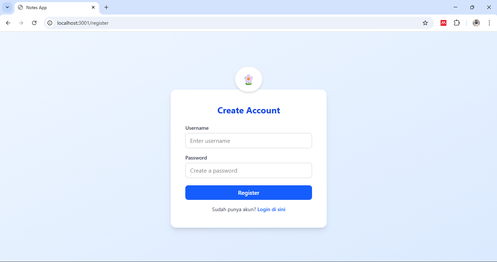
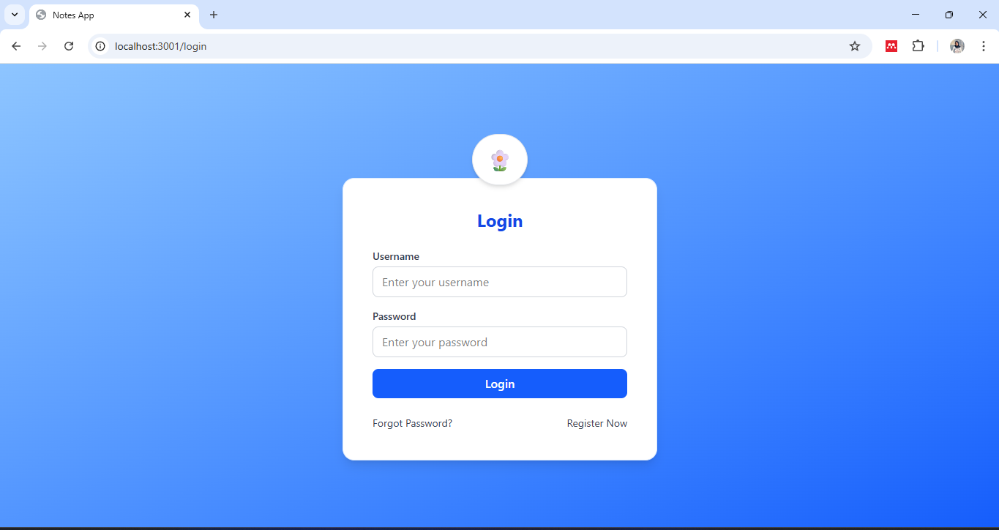
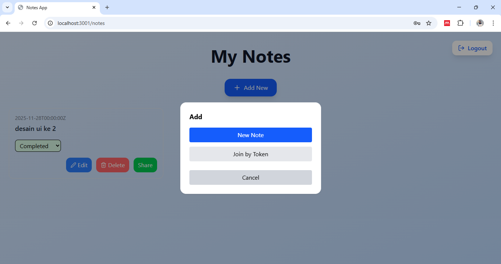

📝 Notes App — Next.js + Go Fiber + PostgreSQL + Docker

Aplikasi catatan kolaboratif dengan fitur:

Register & Login (JWT Auth)

CRUD Notes

Share Notes via Token (Collaborative)

Edit Title Halaman 

Status To-Do / Note

UI Minimalis

Logging otomatis setiap request

🚀 Tech Stack
Frontend

Next.js 14 (App Router)

Tailwind CSS

React Icons

Backend

Go Fiber

PostgreSQL (pgx driver)

JWT Authentication

DevOps

Docker

Docker Compose

📌 1. Setup Lokal (Tanpa Docker)
1. Clone Repo
git clone https://github.com/dindarahma706/notes-sharing-app.git

    cd notes-sharing-app

▣ BACKEND (GO)

2. Masuk folder backend
cd backend

3. Buat file .env
DATABASE_URL=postgres://postgres:postgres@db:5432/notesdb?sslmode=disable
JWT_SECRET=supersecret
PORT=8000

4. Jalankan PostgreSQL secara lokal

    Jika memakai Windows XAMPP/pgAdmin, buat database:

    notesdb

5. Jalankan backend

    go mod tidy
    
    go run main.go

Backend akan berjalan di:

http://localhost:8000

▣ FRONTEND (NEXT.JS)

6. Masuk folder frontend

    cd ../frontend

7. Install dependencies

    npm install

8. Jalankan frontend
    npm run dev

Frontend berjalan di:

http://localhost:3000

📦 2. Setup Docker (Rekomendasi)

Pastikan sudah install:

Docker Desktop

Docker Compose v2

1. Jalankan semua service

Di root project (yang ada docker-compose.yml):

docker compose up --build

Service berjalan di:

Service	URL
Frontend	http://localhost:3000

Backend	http://localhost:8000

PostgreSQL	localhost:5432
2. Stop
docker compose down

🔐 3. Contoh .env Backend

Buat file:

DATABASE_URL=postgres://postgres:postgres@db:5432/notesdb?sslmode=disable
JWT_SECRET=supersecret
PORT=8000

🖼 4. Screenshot Aplikasi

Register Page

Login Page

Notes Page 

